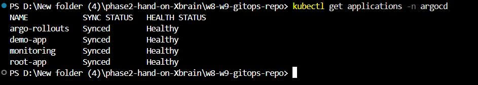
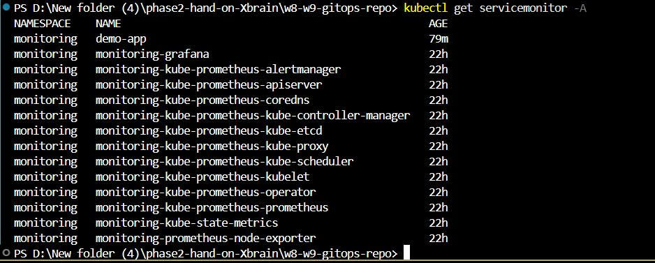
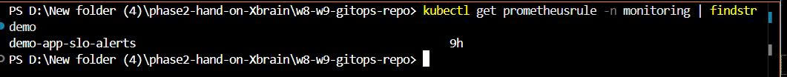
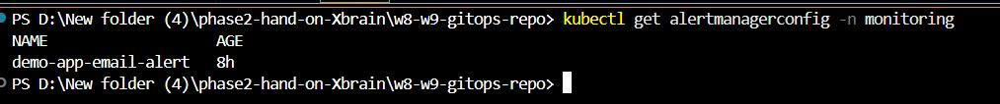
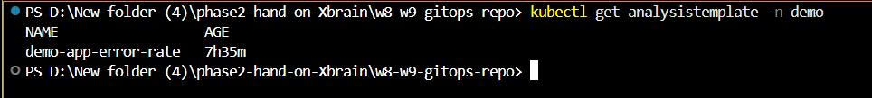

# W8-W9: GitOps, Observability & Canary Deployment with ArgoCD, Prometheus, Grafana and Argo Rollouts

## 1. Mục tiêu

Triển khai ứng dụng theo mô hình GitOps sử dụng ArgoCD.

Tích hợp hệ thống Observability với:

* Prometheus
* Grafana
* ServiceMonitor
* Alertmanager

Triển khai Canary Deployment sử dụng Argo Rollouts.

Toàn bộ thay đổi được thực hiện thông qua Git push và ArgoCD tự động đồng bộ vào Kubernetes Cluster.

---

# 2. Kiến trúc tổng quan

```text
GitHub
   │
   ▼
ArgoCD (GitOps)
   │
   ▼
Kubernetes Cluster
   │
   ├── Demo Application
   │      ├── Frontend
   │      └── Backend (/metrics)
   │
   ├── Prometheus
   ├── Grafana
   ├── Alertmanager
   └── Argo Rollouts
```

---

# PHẦN A — GitOps Foundation Evidence

# 3. Cài đặt GitOps bằng ArgoCD

## Mục tiêu

* Quản lý Kubernetes bằng GitOps.
* Tự động sync khi có thay đổi trên GitHub.
* Dùng ArgoCD làm công cụ kéo manifest từ Git vào Kubernetes Cluster.

## Thực hiện

Tạo các Application:

* root-app
* monitoring
* demo-app
* argo-rollouts

### Kiểm tra

```bash
kubectl get applications -n argocd
```

## Evidence



### Screenshot


## Ý nghĩa

ArgoCD đã quản lý các Application chính trong cluster.
Các app đều được khai báo trong Git và ArgoCD chịu trách nhiệm đồng bộ chúng vào Kubernetes.

---

# 4. App-of-Apps

## Mục tiêu

Sử dụng một `root-app` để quản lý nhiều Application con.

## Cấu trúc

```text
root-app
├── demo-app
├── monitoring
└── argo-rollouts
```

## Kiểm tra

```bash
kubectl get applications -n argocd
```

## Kết quả mong đợi

```text
argo-rollouts   Synced   Healthy
demo-app        Synced   Healthy
monitoring      Synced   Healthy
root-app        Synced   Healthy
```

## Evidence


## Ý nghĩa

`root-app` đóng vai trò quản lý các Application con.
Khi cần thêm app mới, chỉ cần thêm manifest vào Git, ArgoCD sẽ tự động phát hiện và sync.

---

# 5. GitOps Sync qua Git

## Mục tiêu

Chứng minh mọi thay đổi được thực hiện thông qua Git, không apply tay trực tiếp vào cluster.

## Quy trình

```text
Sửa manifest
→ git add
→ git commit
→ git push
→ ArgoCD tự động sync
→ Kubernetes cluster thay đổi theo Git
```

## Lệnh thực hiện

```bash
git add .
git commit -m "update demo app"
git push
```

## Kiểm tra

```bash
kubectl get applications -n argocd
```

## Evidence


## Ý nghĩa

Git là source of truth.
Cluster được đồng bộ theo trạng thái mong muốn trong Git repository.

---

# 6. Self-Heal

## Mục tiêu

Chứng minh nếu có người sửa trực tiếp trong cluster, ArgoCD sẽ tự đưa resource về đúng trạng thái trong Git.

## Lệnh test drift

```bash
kubectl -n demo scale rollout demo-app --replicas=9
```

## Kiểm tra

```bash
kubectl get rollout demo-app -n demo
```

Sau vài giây, ArgoCD self-heal và đưa replicas về giá trị trong Git.

```bash
kubectl get rollout demo-app -n demo
```

## Evidence


## Ý nghĩa

Thay đổi thủ công trong cluster không tồn tại lâu dài.
ArgoCD sẽ tự sửa drift để cluster quay về desired state trong Git.

---

# 7. Sync Waves

## Mục tiêu

Ép thứ tự apply resource bằng annotation:

```yaml
argocd.argoproj.io/sync-wave
```

## Thứ tự áp dụng

```text
ConfigMap / AnalysisTemplate
→ Rollout
→ Service
→ ServiceMonitor
→ PrometheusRule / AlertmanagerConfig
```

## Ví dụ annotation

```yaml
metadata:
  annotations:
    argocd.argoproj.io/sync-wave: "2"
```

## Ý nghĩa

Sync wave giúp tránh lỗi resource phụ thuộc chưa tồn tại.

Ví dụ:

* Rollout cần ConfigMap trước.
* Rollout cần AnalysisTemplate trước khi chạy analysis step.
* ServiceMonitor cần Service tồn tại trước để Prometheus scrape metrics.

## Evidence


---

# 8. CI Build and Push Images

### Mục tiêu

Tự động build Docker image cho backend và frontend sau khi có thay đổi trên branch `main`.

### Workflow file

`.github/workflows/ci.yml`

### Nội dung chính

Workflow thực hiện các bước:

- Checkout source code.
- Tạo image tag từ Git commit SHA.
- Login Docker Hub bằng GitHub Secrets.
- Build backend Docker image.
- Push backend image lên Docker Hub.
- Build frontend Docker image.
- Push frontend image lên Docker Hub.

### Evidence


---

# PHẦN B — Monitoring, Application & Metrics

# 9. Monitoring Stack

## Thành phần

### Prometheus

Thu thập metrics từ cluster và ứng dụng.

### Grafana

Trực quan hóa metrics.

### ServiceMonitor

Cho phép Prometheus scrape metrics từ ứng dụng.

### Alertmanager

Nhận alert từ Prometheus và gửi notification.

---

## Kiểm tra Pod Monitoring

```bash
kubectl get pods -n monitoring
```

## Evidence


---

# 10. Demo Application

## Thành phần

### Frontend

* Nginx
* Port 80

### Backend

* NodeJS Express
* Port 5000

API:

```text
GET /api/health
GET /api/message
GET /metrics
```

---

## Health Check

### Kiểm tra

```bash
curl http://localhost:5000/api/health
```

## Evidence


---

## Message API

### Kiểm tra

```bash
curl http://localhost:5000/api/message
```

## Evidence


---

# 11. Prometheus Metrics

## Mục tiêu

Expose custom metric:

```text
demo_http_requests_total
```

---

## Kiểm tra Metrics Endpoint

```bash
curl http://localhost:5000/metrics
```

## Evidence


---

## Sinh Traffic

```bash
curl http://localhost:5000/api/message
curl http://localhost:5000/api/message
curl http://localhost:5000/api/message
```

---

## Verify Counter

```bash
curl.exe http://localhost:5000/metrics | findstr demo_http
```

## Evidence


---

## Chạy app


---

# 12. ServiceMonitor

## Mục tiêu

Cho phép Prometheus scrape metrics từ namespace `demo`.

---

## Kiểm tra

```bash
kubectl get servicemonitor -A
```

## Evidence



---

# 13. Verify Prometheus Scrape

## Query

```promql
demo_http_requests_total
```

## Evidence


## Ý nghĩa

Prometheus đã scrape được custom metric từ backend thông qua ServiceMonitor.

---

# 14. Grafana Dashboard

## Mục tiêu

Grafana được tích hợp với Prometheus để trực quan hóa các metrics của ứng dụng trong namespace `demo`.

Dashboard giúp theo dõi:

* Số lượng Pod đang hoạt động.
* Mức sử dụng bộ nhớ của từng Pod.
* Lưu lượng HTTP Request đi vào Backend API.
* Hỗ trợ quan sát trạng thái hệ thống trong quá trình Canary Deployment và GitOps rollout.

---

## Dashboard xây dựng

### 1. Running Pod Count

**Ý nghĩa**

Hiển thị số lượng Pod đang ở trạng thái `Running` trong namespace `demo`.

Dashboard này giúp:

* Xác nhận ứng dụng đang hoạt động.
* Quan sát sự thay đổi số lượng Pod khi Rollout hoặc Scale.
* Kiểm tra nhanh tình trạng sẵn sàng của workload.

**PromQL**

```promql
count(
  kube_pod_status_phase{
    namespace="demo",
    phase="Running"
  }
)
```

---

### 2. Memory Usage

**Ý nghĩa**

Hiển thị lượng RAM đang được sử dụng bởi từng Pod của ứng dụng.

Dashboard này giúp:

* Theo dõi mức tiêu thụ bộ nhớ của Backend và Frontend.
* Phát hiện Pod có dấu hiệu sử dụng bộ nhớ bất thường.
* Là cơ sở để điều chỉnh Resource Requests/Limits.

**PromQL**

```promql
sum by (pod) (
  container_memory_working_set_bytes{
    namespace="demo",
    container!="",
    container!="POD"
  }
)
```

---

### 3. HTTP Requests

**Ý nghĩa**

Hiển thị tốc độ request được ghi nhận từ custom metric `demo_http_requests_total`.

Metric này được expose bởi Backend thông qua endpoint:

```text
/metrics
```

và được Prometheus scrape thông qua ServiceMonitor.

Dashboard này giúp:

* Xác nhận Prometheus đã thu thập được custom metric.
* Theo dõi lưu lượng truy cập vào API.
* Chứng minh luồng Observability hoạt động đầy đủ:

```text
Application → Prometheus → Grafana
```

**PromQL**

```promql
sum by (route) (
  rate(demo_http_requests_total[5m])
)
```

### Evidence


---

# PHẦN C — Manual Canary Deployment

# 15. Canary Deployment với Argo Rollouts

## Chiến lược

```yaml
steps:
  - setWeight: 25
  - pause: {}

  - setWeight: 50
  - pause:
      duration: 30s

  - setWeight: 100
```

## Ý nghĩa

* `setWeight: 25`: đưa 25% traffic sang phiên bản mới.
* `pause: {}`: dừng rollout để kiểm tra thủ công.
* `setWeight: 50`: tăng lên 50%.
* `setWeight: 100`: promote phiên bản mới lên 100%.

---

# 16. Canary 25%

## Thay đổi

```yaml
APP_VERSION=v1
```

↓

```yaml
APP_VERSION=v2
```

Push Git.

ArgoCD tự sync.

---

## Kiểm tra

```bash
kubectl describe rollout demo-app -n demo
```

## Evidence


---

# 17. Promote Canary

## Tiếp tục rollout

Promote rollout.

---

## Kiểm tra

```bash
kubectl describe rollout demo-app -n demo
```

### Kết quả

```text
Rollout step 3/5 completed (setWeight: 50)
```

## Evidence


---

# 18. Rollout 100%

## Kiểm tra

```bash
kubectl describe rollout demo-app -n demo
```

### Kết quả

```text
Rollout step 5/5 completed (setWeight: 100)
```

## Evidence


---

# 19. Rollout Completed

## Kiểm tra

```bash
kubectl describe rollout demo-app -n demo
```

### Kết quả

```text
Rollout completed update to revision
Completed all 5 canary steps
```

## Evidence


---

# 20. ReplicaSet Verification

## Kiểm tra

```bash
kubectl get rs -n demo
```

### Kết quả

```text
demo-app-new-rs  2
demo-app-old-rs  0
```

Ý nghĩa:

* 100% traffic sang phiên bản mới.
* Phiên bản cũ không còn phục vụ traffic.

## Evidence


---

# PHẦN D — SLO Alert & Email Notification

# 21. SLO Alert với PrometheusRule

## Mục tiêu

Tạo SLO availability cho demo app.

```text
Availability SLO = 95%
```

Nếu HTTP 5xx error rate vượt 5% trong hơn 1 phút, Prometheus sẽ fire alert.

---

## PrometheusRule

```yaml
apiVersion: monitoring.coreos.com/v1
kind: PrometheusRule
metadata:
  name: demo-app-slo-alerts
  namespace: monitoring
  labels:
    release: monitoring
  annotations:
    argocd.argoproj.io/sync-wave: "4"
spec:
  groups:
    - name: demo-app-slo.rules
      rules:
        - alert: DemoAppHighErrorRate
          expr: |
            (
              sum(rate(demo_http_requests_total{namespace="demo", status_code=~"5.."}[2m]))
              /
              clamp_min(sum(rate(demo_http_requests_total{namespace="demo"}[2m])), 0.001)
            ) > 0.05
          for: 1m
          labels:
            severity: warning
            service: demo-app
            slo: availability
            namespace: monitoring
          annotations:
            summary: "Demo App high error rate"
            description: "Demo App API error rate is above 5% for more than 1 minute. This violates the 95% availability SLO."
```

---

## Ý nghĩa PromQL alert

### Tính tốc độ lỗi 5xx

```promql
sum(rate(demo_http_requests_total{namespace="demo", status_code=~"5.."}[2m]))
```

### Tính tổng request

```promql
sum(rate(demo_http_requests_total{namespace="demo"}[2m]))
```

### Tỷ lệ lỗi

```text
error_rate = 5xx_requests / total_requests
```

Nếu:

```text
error_rate > 0.05
```

nghĩa là lỗi vượt 5%.

Vì rule có:

```yaml
for: 1m
```

nên alert chỉ `Firing` khi lỗi kéo dài hơn 1 phút.

---

## Kiểm tra PrometheusRule

```bash
kubectl get prometheusrule -n monitoring | findstr demo
```

## Evidence



---

# 22. Inject lỗi để kích hoạt alert

## Thay đổi app sang bản lỗi

```yaml
env:
  - name: APP_VERSION
    value: "alert-test"
  - name: ERROR_RATE
    value: "1"
```

## Tạo traffic

```bash
kubectl port-forward svc/demo-app -n demo 5001:5000
```

```powershell
for ($i=1; $i -le 600; $i++) {
  curl.exe -s -o NUL "http://localhost:5001/api/message"
  Start-Sleep -Milliseconds 200
}
```

## Query kiểm tra lỗi 500

```promql
sum by (status_code) (
  increase(demo_http_requests_total{namespace="demo"}[2m])
)
```

## Evidence


---

# 23. Alert Firing

## Evidence


## Ý nghĩa

Prometheus phát hiện error rate vượt 5% trong hơn 1 phút, nên alert `DemoAppHighErrorRate` chuyển sang `Firing`.

---

# 24. Alertmanager gửi email cá nhân

## Secret chứa Gmail App Password

```bash
kubectl create secret generic alertmanager-email-secret \
  -n monitoring \
  --from-literal=password="<GMAIL_APP_PASSWORD>"
```

Kiểm tra:

```bash
kubectl get secret alertmanager-email-secret -n monitoring
```

## Evidence


---

## AlertmanagerConfig

```yaml
apiVersion: monitoring.coreos.com/v1alpha1
kind: AlertmanagerConfig
metadata:
  name: demo-app-email-alert
  namespace: monitoring
  labels:
    release: monitoring
  annotations:
    argocd.argoproj.io/sync-wave: "4"
spec:
  route:
    receiver: personal-email
    groupBy:
      - alertname
      - service
    groupWait: 10s
    groupInterval: 1m
    repeatInterval: 30m
    matchers:
      - name: alertname
        matchType: =
        value: DemoAppHighErrorRate

  receivers:
    - name: personal-email
      emailConfigs:
        - to: "bapn839@gmail.com"
          from: "bapn839@gmail.com"
          smarthost: "smtp.gmail.com:587"
          authUsername: "bapn839@gmail.com"
          authIdentity: "bapn839@gmail.com"
          authPassword:
            name: alertmanager-email-secret
            key: password
          requireTLS: true
          sendResolved: true
```

## Kiểm tra

```bash
kubectl get alertmanagerconfig -n monitoring
```

## Evidence



---

## Alertmanager nhận alert

Mở Alertmanager UI:

```bash
kubectl port-forward svc/monitoring-kube-prometheus-alertmanager -n monitoring 9093:9093
```

```text
http://localhost:9093
```

## Evidence


---

## Gmail nhận alert

## Evidence


## Ý nghĩa

Alertmanager đã route alert `DemoAppHighErrorRate` tới receiver `personal-email` và gửi email thành công về Gmail cá nhân.

---

# 25. Rollback sau alert bằng git revert

## Lệnh thực hiện

```bash
git log --oneline -5
git revert <commit_id> --no-edit
git push
```

## Kiểm tra

```bash
kubectl get rollout demo-app -n demo -o yaml | findstr APP_VERSION
kubectl get rollout demo-app -n demo -o yaml | findstr ERROR_RATE
kubectl get applications -n argocd
```

## Kết quả

```text
APP_VERSION=v2-stable
ERROR_RATE=0
```

```text
argo-rollouts   Synced   Healthy
demo-app        Synced   Healthy
monitoring      Synced   Healthy
root-app        Synced   Healthy
```

## Evidence


---

# PHẦN E — Canary Auto-Abort với AnalysisTemplate

# 26. Mục tiêu

Canary deployment phải tự động abort nếu bản canary sinh lỗi HTTP 5xx.

Flow:

```text
Deploy bad canary
→ 25% traffic sang bản mới
→ AnalysisTemplate query Prometheus
→ phát hiện 5xx
→ AnalysisRun Failed
→ bad ReplicaSet scale về 0
→ stable ReplicaSet vẫn chạy
```

---

# 27. Rollout có Analysis Step

```yaml
strategy:
  canary:
    steps:
      - setWeight: 25
      - pause:
          duration: 30s
      - analysis:
          templates:
            - templateName: demo-app-error-rate
      - setWeight: 50
      - pause:
          duration: 30s
      - setWeight: 100
```

## Ý nghĩa

```text
25% traffic sang canary
→ đợi 30 giây
→ chạy AnalysisTemplate
→ nếu metric tốt thì rollout tiếp
→ nếu metric xấu thì AnalysisRun Failed và rollout bị chặn
```

---

# 28. AnalysisTemplate

```yaml
apiVersion: argoproj.io/v1alpha1
kind: AnalysisTemplate
metadata:
  name: demo-app-error-rate
  namespace: demo
  annotations:
    argocd.argoproj.io/sync-wave: "1"
spec:
  metrics:
    - name: demo-app-5xx-count
      interval: 20s
      count: 3
      failureLimit: 1
      successCondition: result[0] == 0
      provider:
        prometheus:
          address: http://monitoring-kube-prometheus-prometheus.monitoring.svc.cluster.local:9090
          query: |
            sum(
              increase(
                demo_http_requests_total{
                  namespace="demo",
                  status_code=~"5.."
                }[2m]
              )
            ) or vector(0)
```

## Ý nghĩa

Query kiểm tra HTTP 5xx trong 2 phút gần nhất.

```text
result[0] == 0
```

nghĩa là canary chỉ pass khi không có lỗi 5xx.

Nếu có lỗi:

```text
result[0] > 0
→ successCondition false
→ AnalysisRun Failed
→ bad canary không được promote
```

---

# 29. Deploy bản lỗi để test auto-abort

```yaml
env:
  - name: APP_VERSION
    value: "auto-abort-test"
  - name: ERROR_RATE
    value: "1"
```

Push qua Git:

```bash
git add k8s/demo-app/deployment.yaml k8s/demo-app/analysis-template.yaml
git commit -m "enable canary auto abort"
git push
```

---

# 30. Check AnalysisTemplate tồn tại

```bash
kubectl get analysistemplate -n demo
```

## Kết quả

```text
demo-app-error-rate
```

## Evidence



---

# 31. AnalysisRun Failed

## Kiểm tra

```bash
kubectl get analysisrun -n demo
```

## Kết quả

```text
demo-app-596dff78c-8-2   Failed
```

## Evidence


---

# 32. Describe AnalysisRun

```bash
kubectl describe analysisrun demo-app-596dff78c-8-2 -n demo
```

## Kết quả quan trọng

```text
Phase: Failed
MetricFailed
Metric 'demo-app-5xx-count' Completed. Result: Failed
AnalysisRunFailed
Analysis Completed. Result: Failed
```

## Evidence


## Ý nghĩa

Argo Rollouts đã chạy AnalysisTemplate. Prometheus query phát hiện HTTP 5xx, nên metric failed và AnalysisRun chuyển sang `Failed`.

---

# 33. ArgoCD Degraded khi canary bị abort

## Evidence


## Ý nghĩa

Trong lúc test auto-abort, ArgoCD hiển thị:

```text
APP HEALTH: Degraded
```

Đây là expected behavior vì Rollout không hoàn tất do AnalysisRun Failed.

`Degraded` không có nghĩa là toàn bộ app chết. Trong trường hợp này, nó có nghĩa là bản canary lỗi bị phát hiện và rollout bị chặn.

---

# 34. ReplicaSet sau auto-abort

## Kiểm tra

```bash
kubectl get rs -n demo
```

## Kết quả

```text
demo-app-596dff78c   0   0   0
demo-app-894dd67d7   2   2   2
```

## Evidence


## Ý nghĩa

* `demo-app-596dff78c` là ReplicaSet của bản canary lỗi.
* ReplicaSet lỗi bị scale về `0`.
* `demo-app-894dd67d7` là ReplicaSet stable trước đó.
* Stable ReplicaSet vẫn chạy `2 replicas`.

Điều này chứng minh bản lỗi không được promote lên 100%, và hệ thống được bảo vệ bởi Argo Rollouts.

---

# PHẦN F — Restore Stable Final State

# 35. Restore stable version sau auto-abort test

## Mục tiêu

Sau khi lấy evidence auto-abort, đưa Git về trạng thái stable để cluster kết thúc ở trạng thái Healthy.

## Stable Rollout

```yaml
strategy:
  canary:
    steps:
      - setWeight: 25
      - pause:
          duration: 30s
      - setWeight: 50
      - pause:
          duration: 30s
      - setWeight: 100
```

```yaml
env:
  - name: APP_VERSION
    value: "v2-stable"
  - name: ERROR_RATE
    value: "0"
```

## Commit restore stable

```bash
git add k8s/demo-app/deployment.yaml
git commit -m "restore stable rollout after auto abort test"
git push
```

---

# 36. Final health check

## Kiểm tra Rollout

```bash
kubectl get rollout demo-app -n demo
```

## Kết quả

```text
demo-app   DESIRED=2   CURRENT=2   UP-TO-DATE=2   AVAILABLE=2
```

## Kiểm tra ArgoCD Applications

```bash
kubectl get applications -n argocd
```

## Kết quả

```text
argo-rollouts   Synced   Healthy
demo-app        Synced   Healthy
monitoring      Synced   Healthy
root-app        Synced   Healthy
```

## Evidence


---

# 37. Alert trở về Inactive

Sau khi `ERROR_RATE=0`, Prometheus alert trở về trạng thái `Inactive`.

## Evidence


---

# 38. Kết quả đạt được

## GitOps

✅ ArgoCD

✅ App of Apps

✅ Automatic Sync

✅ Self-Heal

✅ Sync Waves

✅ Git revert rollback

✅ CI validate manifest

---

## Observability

✅ Prometheus

✅ Grafana

✅ ServiceMonitor

✅ Custom Metrics

✅ PrometheusRule

✅ Alertmanager Email Notification

---

## Canary Deployment

✅ Argo Rollouts

✅ Canary 25%

✅ Manual Approval

✅ Promote

✅ Rollout 100%

✅ Completed

✅ AnalysisTemplate

✅ Canary Auto-Abort

---

# 39. Checklist chấm điểm

| Yêu cầu                          | Trạng thái | Evidence                                                                                    |
| -------------------------------- | ---------: | ------------------------------------------------------------------------------------------- |
| Thay đổi qua Git + ArgoCD Synced |          ✅ | `./Evidence/Application.jpg`                                                                |
| App-of-Apps                      |          ✅ | `./Evidence/Application.jpg`                                                                |
| Self-heal                        |          ✅ | `./Evidence/Self%20Heal.jpg`                                                                |
| Sync waves                       |          ✅ | `./Evidence/Sync%20Wave.jpg`                                                                |
| CI validate manifest             |          ✅ | `./Evidence/CI%20Validate.jpg`                                                              |
| Prometheus scrape metrics        |          ✅ | `./Evidence/Prometheus%20Query.jpg`                                                         |
| Grafana dashboard                |          ✅ | `./Evidence/Dashboard%20Overview.jpg`                                                       |
| Canary 25%                       |          ✅ | `./Evidence/Pause%2025%25.jpg`                                                              |
| Promote canary                   |          ✅ | `./Evidence/Promote%20Canary.jpg`                                                           |
| Rollout 100%                     |          ✅ | `./Evidence/Rollout%20100%25.jpg`                                                           |
| Rollout completed                |          ✅ | `./Evidence/Rollout%20Completed.jpg`                                                        |
| 1 SLO + 1 alert fire             |          ✅ | `./Evidence/Prometheus%20Alert%20Firing.jpg`                                                |
| Alert gửi về email cá nhân       |          ✅ | `./Evidence/Gmail%20Alert.jpg`                                                              |
| Rollback bằng git revert         |          ✅ | `./Evidence/Rollback%20After%20Alert.jpg`                                                   |
| Canary bản lỗi tự abort          |          ✅ | `./Evidence/AnalysisRun%20Failed.jpg` + `./Evidence/Canary%20Auto%20Abort%20ReplicaSet.jpg` |
| Restore stable sau test          |          ✅ | `./Evidence/Final%20Healthy.jpg`                                                            |
| Alert inactive sau rollback      |          ✅ | `./Evidence/Alert%20Inactive.jpg`                                                           |

---

# 40. Bài học rút ra

* GitOps giúp đồng bộ trạng thái cluster từ Git.
* ArgoCD giúp phát hiện drift và tự self-heal.
* App-of-Apps giúp quản lý nhiều Application dễ hơn.
* Sync Waves giúp kiểm soát thứ tự apply resource.
* Prometheus + Grafana cung cấp khả năng quan sát hệ thống theo thời gian thực.
* ServiceMonitor giúp tích hợp ứng dụng với Prometheus dễ dàng.
* PrometheusRule giúp định nghĩa SLO alert.
* Alertmanager giúp gửi cảnh báo đến người vận hành.
* Argo Rollouts hỗ trợ Canary Deployment an toàn hơn Deployment mặc định của Kubernetes.
* AnalysisTemplate giúp tự động đánh giá bản canary bằng metric thật.
* Khi bản lỗi sinh HTTP 5xx, AnalysisRun Failed và bản lỗi không được promote, giúp bảo vệ hệ thống.
